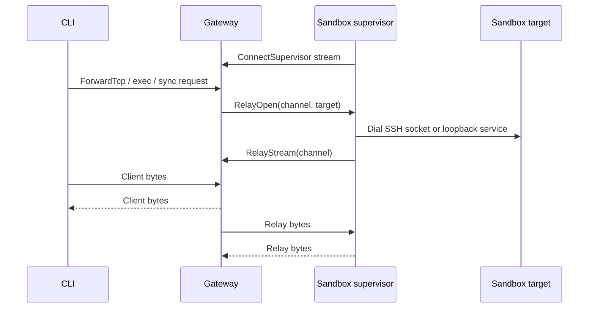

# Gateway

The gateway is the OpenShell control plane. It exposes the API used by the CLI,
SDK, and TUI; persists platform state; manages provider credentials and
inference configuration; and asks compute runtimes to create or delete sandbox
workloads.

## Responsibilities

- Authenticate clients and sandbox callbacks.
- Serve gRPC APIs for sandbox lifecycle, provider management, policy updates,
  settings, inference configuration, logs, watch streams, and relay forwarding.
- Serve HTTP endpoints for health, WebSocket tunnels, and edge-auth flows.
- Persist domain objects in SQLite or Postgres.
- Resolve provider credentials and inference bundles for sandbox supervisors.
- Coordinate supervisor relay sessions for connect, exec, file sync, and
  service forwarding.

The gateway does not enforce agent network policy at request time. That happens
inside each sandbox, where the supervisor and proxy can observe local process
identity.

## Protocol and Auth

The gateway listens on one service port and multiplexes gRPC and HTTP traffic.
The default local single-user deployment mode is mTLS user authentication:
clients present a certificate signed by the local deployment CA, and the
gateway maps the verified certificate subject to a user principal. Kubernetes
deployments use mTLS for transport only and require OIDC or a trusted access
proxy for user authentication unless the explicit unsafe local-development
`allow_unauthenticated_users` switch is enabled.
When that service port is bound to loopback, the listener can also accept
plaintext HTTP on the same port for sandbox service subdomains only. That local
browser path is enabled by default and disabled with
`--enable-loopback-service-http=false`; it never serves gateway APIs, auth,
health, metrics, or tunnel routes. The plaintext service router also rejects
browser requests whose Fetch Metadata, Origin, or Referer headers indicate a
cross-origin or sibling-subdomain request.

Supported auth modes:

| Mode | Use |
|---|---|
| mTLS user auth | Local single-user Docker, Podman, and VM gateway access. |
| Plaintext | Local development or a trusted reverse proxy boundary. |
| Unauthenticated local users | Trusted Kubernetes dev or fully trusted proxy deployments only. |
| Cloudflare JWT | Edge-authenticated deployments where Cloudflare Access supplies identity. |
| OIDC | Bearer-token auth for users, with browser PKCE or client credentials login. |

Sandbox supervisor RPCs authenticate with gateway-minted sandbox JWTs when that
authenticator is configured; mTLS does not grant sandbox identity. User-facing
mutations are authorized by role policy when OIDC or edge identity is enabled.

Sandbox secrets are gateway-signed JWTs bound to a single sandbox ID. Docker,
Podman, and VM drivers deliver the initial token through supervisor-only
runtime material; Kubernetes supervisors exchange a projected ServiceAccount
token through `IssueSandboxToken`. The gateway validates that projected token
with Kubernetes `TokenReview`, requires the configured sandbox service account,
checks the returned pod binding against the live pod UID, and verifies the pod's
controlling `Sandbox` ownerReference against the live Sandbox CR UID and
sandbox-id label before minting the gateway JWT. Supervisors renew gateway JWTs
in memory before expiry only while the sandbox record still exists. Older tokens
are not server-revoked; deployments bound replay exposure with short
`gateway_jwt.ttl_secs` lifetimes.

Gateway JWT signing-key rotation is currently an offline operator action. The
runtime loads one active signing key and one matching public verification key
from the configured secret at startup. To rotate that key material today,
operators must delete or replace the JWT key secret, let certgen recreate it,
and restart the gateway pods. This invalidates outstanding supervisor tokens;
running supervisors recover by re-running their bootstrap path where available
or by reconnecting after sandbox restart. Online rotation with multiple
verification keys keyed by `kid` is tracked separately.

Sandbox JWTs are not user credentials. The gRPC router accepts
`Principal::Sandbox` only on the supervisor-to-gateway RPC allowlist
(`ConnectSupervisor`, `RelayStream`, token renewal, config sync, policy status,
log push, and policy-analysis callbacks). Handlers then compare the
authenticated sandbox ID with any sandbox ID or name resolved from the request.
Supervisor control and relay streams require a matching sandbox principal before
the gateway registers the session or bridges relay bytes.

## API Surface

The gateway API is organized around platform objects and operational streams:

| Area | Examples |
|---|---|
| Sandbox lifecycle | Create, list, delete, watch, exec, SSH session bootstrap, ForwardTcp service forwarding. |
| Providers | Store provider records, discover credentials, resolve runtime environment. |
| Policy and settings | Get effective sandbox config, update sandbox policy, manage global settings. |
| Inference | Set gateway-level model/provider config and resolve sandbox route bundles. |
| Observability | Push sandbox logs, stream sandbox status and logs to clients. |

Domain objects use shared metadata: stable server-generated IDs, human-readable
names, creation timestamps, and labels. Crate-level details live in
`crates/openshell-core/README.md`.

## Persistence

The gateway persistence layer is a protobuf object store. Domain services store
typed protobuf messages as opaque binary payloads, while the database keeps a
small set of indexed metadata columns for lookup, listing, versioning, and
workflow state. The implementation lives in the
[gateway persistence module](../crates/openshell-server/src/persistence/mod.rs);
backend-specific SQL lives in the SQLite and Postgres migration directories
under `crates/openshell-server/migrations/`.

The storage schema is intentionally narrow:

| Column | Purpose |
|---|---|
| `id` | Stable gateway-generated object ID and primary key. |
| `object_type` | Logical resource kind, such as `sandbox`, `provider`, `ssh_session`, `inference_route`, `sandbox_policy`, or `draft_policy_chunk`. |
| `name` | Human-readable name, unique within an object type when present. |
| `scope` | Optional owner or namespace for scoped/versioned records, such as a sandbox ID for policy revisions. |
| `version` | Optional monotonically increasing version for scoped records. |
| `status` | Optional workflow state for records such as policy revisions or draft policy chunks. |
| `dedup_key` and `hit_count` | Optional policy-advisor fields for coalescing repeated observations. |
| `resource_version` | Monotonically increasing counter for optimistic concurrency control. Incremented atomically on each update. |
| `payload` | Prost-encoded protobuf payload for the full domain object. |
| `created_at_ms` and `updated_at_ms` | Gateway timestamps used for ordering and list output. |
| `labels` | JSON object carrying Kubernetes-style object labels for filtering and organization. |

Common resources use generic helpers that derive `object_type`, `id`, `name`,
and labels from protobuf metadata traits before encoding the full message into
`payload`. Policy revisions and draft policy chunks use the same table but also
populate `scope`, `version`, `status`, `dedup_key`, and `hit_count` so the
gateway can efficiently fetch the latest policy, track load status, and manage
advisor drafts without creating resource-specific tables.

SQLite is the default local store; Postgres is supported for deployments that
need an external database or multi-replica coordination. Both backends expose
the same `Store` API and the same logical schema. Backend differences stay
inside the adapters: for example, SQLite stores labels as JSON text and payloads
as `BLOB`, while Postgres stores labels as `JSONB` and payloads as `BYTEA`.
Domain code should depend on the object-store contract, not SQL dialect details.
This keeps the gateway data model portable across storage backends and leaves
room for future stores that can provide the same object, label, version, and
scope semantics.

The SQLite adapter tightens the on-disk database file to mode `0o600` on every
connect so that provider API keys, SSH session tokens, and sandbox metadata are
not readable by other local users on shared hosts. The same restriction is
reapplied to the `<db>-wal` and `<db>-shm` sidecars (created by SQLite's
default WAL journal mode), which mirror the same sensitive contents.

Persisted state includes sandboxes, providers, provider credential refresh
state, SSH sessions, policy revisions, settings, inference configuration, and
deployment records. Provider refresh material is stored as a separate object
scoped to the provider instance through `objects.scope`; the provider record
keeps only the current injectable credential values and optional per-credential
expiry timestamps.

### Optimistic Concurrency (CAS)

Every object row carries a `resource_version` that the database increments
atomically on each write. Concurrent mutations use compare-and-swap (CAS): the
writer reads the current version, applies changes, and writes back with a
`WHERE resource_version = <expected>` guard. If another writer updated the row
in between, the guard fails and the caller receives a `Conflict` error.

This matters for HA deployments where multiple gateway replicas share the same
Postgres database, and for single-node deployments where concurrent gRPC
handlers or the reconciler mutate the same sandbox.

**Compile-time enforcement.** The unconditional write methods `put` and
`put_message` are gated behind `#[cfg(test)]`. Production code must use
`put_if` with an explicit `WriteCondition` or `update_message_cas`. The
compiler rejects any other write path, making non-CAS writes structurally
impossible outside of tests.

Every write goes through one of three conditions:

- `MustCreate` -- insert-only. The database rejects the write with a
  `UniqueViolation` error if a row with that ID already exists. Handlers match
  on the structured `PersistenceError::UniqueViolation { .. }` variant to
  distinguish creation conflicts from other failures.
- `MatchResourceVersion(v)` -- update-only. The database rejects the write
  with a `Conflict` error if the current version differs from `v`.
- `Unconditional` -- test-only; not reachable in production builds.

**Creates.** All create paths use `MustCreate` and hydrate the response
directly from the `WriteResult` returned by `put_if`, which carries the
assigned `resource_version`, `created_at_ms`, and `updated_at_ms`. This
eliminates a read-after-write round trip and the race window that would come
with it.

**Updates.** The `update_message_cas` helper makes a single CAS attempt: it
fetches the current object, applies a mutation closure, and writes with a
`MatchResourceVersion` condition. On conflict the persistence layer returns a
`Conflict` error, which gRPC handlers map to `ABORTED` status so the client
(or the next watch/reconcile event) can retry with fresh state. There is no
automatic retry loop.

The helper accepts an `expected_version` parameter that selects between two
modes:

- **Server-driven** (`expected_version = 0`): the helper uses the version it
  just read from the database. Internal operations (reconciler, policy status
  reports, compute phase transitions) use this mode because the caller does
  not track versions.
- **Client-driven** (`expected_version != 0`): the helper validates that the
  caller's version matches the current database version before applying the
  mutation. If they diverge it returns `Conflict` without attempting the
  write. Client-facing operations that carry an `expected_resource_version`
  field use this mode: `AttachSandboxProvider`, `DetachSandboxProvider`,
  `UpdateProvider`, and `UpdateConfig` (policy backfill path).

**Lists.** The `list_messages` and `list_messages_with_selector` helpers decode
protobuf payloads from list results and hydrate `resource_version` from the
authoritative database column into each decoded message, mirroring the
`get_message` pattern. This ensures list responses carry correct versions
without requiring callers to manually hydrate each record.

**Deletes.** Delete operations are not yet CAS-protected -- the delete request
protos do not carry `expected_resource_version`. A `delete_if` primitive exists
in the persistence layer but is not wired into gRPC handlers.

**Coverage.** All `ObjectMeta`-bearing message types have write-condition
coverage:

| Type | Create | Update | List |
|---|---|---|---|
| Sandbox | `MustCreate` | `update_message_cas` | `list_messages` |
| Provider | `MustCreate` | `update_message_cas` | `list_messages` |
| ProviderProfile | `MustCreate` | (immutable) | `list_messages` |
| InferenceRoute | `MustCreate` | `update_message_cas` | `list_messages` |
| SandboxPolicy | scoped versioning | scoped versioning | scoped query |
| Settings | `Mutex`-guarded | `Mutex`-guarded | single-row |

Global settings updates use a Tokio `Mutex` to serialize multi-step
validation within a single gateway process, with CAS on the underlying
persistence write as defense in depth. In an HA deployment with multiple
gateways, the Mutex alone would be insufficient. Sandbox-scoped settings
rely entirely on CAS without a Mutex.

The `resource_version` is surfaced to clients through `ObjectMeta` in proto
responses. Database migrations backfill existing rows with version 1.

Policy and runtime settings are delivered together through the effective sandbox
config path. A gateway-global policy can override sandbox-scoped policy. The
sandbox supervisor polls for config revisions and hot-reloads dynamic policy
when the policy engine accepts the update.

Provider credential expiry is enforced during gateway-to-sandbox credential
resolution and again by the sandbox placeholder resolver. This keeps expired
credentials from resolving even when a running sandbox still has retained
placeholder generations from an earlier provider credential snapshot.

## Inference Resolution

Cluster inference routes store only `provider_name`, `model_id`, and optional
timeout. The gateway resolves endpoint URLs, protocols, credentials, auth
style, and route-shaping metadata from the provider record when supervisors call
`GetInferenceBundle`. Supported provider types for cluster inference are
`openai`, `anthropic`, `nvidia`, and `google-vertex-ai`.

The bundle carries enough information for sandbox-local routers to construct
upstream URLs without re-deriving provider-specific routing logic. Each resolved
route may include:

| Field | Meaning |
|---|---|
| `model_in_path` | When true, the model identifier is part of the upstream URL path, not only the request body. |
| `request_path_override` | Path override or suffix. With `model_in_path=false`, replaces the protocol-derived path; with `model_in_path=true`, appended after the model ID. |

For standard providers these fields stay unset and the sandbox router uses default
protocol paths. Vertex AI is model-aware: the gateway constructs the base URL
from provider config (`VERTEX_AI_PROJECT_ID`, `VERTEX_AI_REGION`, optional
`VERTEX_AI_PUBLISHER`) and emits route-shaping metadata so the sandbox router
stays provider-agnostic.

Host selection follows the configured region:

| Region value | Vertex host |
|---|---|
| `global` | `aiplatform.googleapis.com` |
| `us` or `eu` | `aiplatform.{region}.rep.googleapis.com` |
| Any other (e.g. `us-central1`) | `{region}-aiplatform.googleapis.com` |

Route shaping by publisher:

- **Anthropic (Claude)** — `model_in_path=true`, base path under
  `publishers/anthropic/models`, protocol `anthropic_messages` only. The gateway
  resolves `request_path_override=:rawPredict`; the sandbox router keeps
  `:rawPredict` for buffered requests and upgrades to `:streamRawPredict` only
  for streaming proxy calls.
- **All other models** (Gemini, third-party, unknown) — OpenAI-compatible
  `.../endpoints/openapi` base with `request_path_override=/chat/completions`;
  protocol `openai_chat_completions`.

Callers may supply `GOOGLE_VERTEX_AI_BASE_URL` or `VERTEX_AI_BASE_URL` only for
non-Anthropic routes. Anthropic base URL overrides are rejected because they
cannot safely preserve model-path shaping and `anthropic_version` body
adaptation. Overrides still pin `request_path_override=/chat/completions` and
must use `https` with an official Vertex AI hostname (`aiplatform.googleapis.com`,
`aiplatform.{us,eu}.rep.googleapis.com`, or `{region}-aiplatform.googleapis.com`).

Header passthrough is protocol-dependent. Vertex Claude rawPredict routes strip
client `anthropic-beta` headers; `anthropic-version` is not forwarded because
the sandbox router injects `anthropic_version` into the request body for Vertex
rawPredict. Non-Anthropic Vertex routes do not inherit Anthropic passthrough
headers.

For `google-vertex-ai` providers created with CLI `--from-gcloud-adc`, the CLI
calls gateway `ConfigureProviderRefresh` with OAuth2 refresh material from gcloud
ADC, then `RotateProviderCredential` to mint the first access token before
reporting success. ADC-backed providers mint into `GOOGLE_VERTEX_AI_TOKEN`. A
successful create therefore yields an immediately usable provider; failures roll
back the provider record. Service-account JSON and private keys are gateway-side
refresh bootstrap material only; sandbox runtime inference receives minted
access tokens, not raw service-account material.

## Supervisor Relay

Sandbox workloads maintain an outbound supervisor session to the gateway. This
lets the gateway open per-request byte relays without requiring inbound network
access to the sandbox workload.



The same relay pattern backs interactive SSH, command execution, file sync, and
local service forwarding. The gateway tracks live sessions in memory and
persists session records so tokens can expire or be revoked.

`ForwardTcp` is the client-facing byte stream for SSH and service forwarding.
The first frame is a `TcpForwardInit` that carries the sandbox ID, an
authorization token from `CreateSshSession`, and an explicit target:
`target.ssh` for the sandbox SSH socket or `target.tcp` for a loopback service
inside the sandbox. The gateway validates the token and sandbox readiness,
sends a targeted `RelayOpen` to the supervisor, then bridges
`TcpForwardFrame::Data` to `RelayFrame::Data` until either side closes.

Browser service URLs use the same supervisor relay path after host-based
routing resolves `sandbox--service.<service-routing-domain>` to a stored
service endpoint. Accepted service routing domains are derived from wildcard
DNS SANs configured on the gateway server certificate, with
`openshell.localhost` available by default for loopback gateways. TLS-enabled
loopback gateways print `http://` URLs when loopback plaintext service HTTP is
enabled; non-loopback TLS gateways continue to print `https://` URLs.

For `target.tcp`, the gateway only accepts loopback destinations such as
`localhost`, `127.0.0.0/8`, or `::1`. The gateway never needs to know or dial a
sandbox pod IP; supervisors connect outbound and bridge only the explicit target
requested for that relay.

## PKI Bootstrap

`openshell-gateway generate-certs` is the one place mTLS materials are
created. Both deployment paths use it:

| Output mode | Selector | Layout |
|---|---|---|
| Kubernetes Secrets | (default) `--namespace`, `--server-secret-name`, `--client-secret-name` | Two `kubernetes.io/tls` Secrets with `tls.crt` / `tls.key` / `ca.crt`. |
| Filesystem | `--output-dir <DIR>` | `<dir>/{ca.crt, ca.key, server/tls.{crt,key}, client/tls.{crt,key}}`. Also copies client materials to `$XDG_CONFIG_HOME/openshell/gateways/openshell/mtls/` for CLI auto-discovery. |

On Kubernetes, the Helm chart runs the command via a pre-install/pre-upgrade
hook Job using the gateway image itself -- no separate cert-generation image,
no extra mirror burden in air-gapped environments. On package-managed local
gateways, the same command runs from the systemd unit's `ExecStartPre` to
bootstrap PKI into the configured local TLS directory on first start. The
Linux package unit defaults that directory to `~/.local/state/openshell/tls`
through `OPENSHELL_LOCAL_TLS_DIR` so certificate generation and runtime
auto-detection use the same path across systemd versions.

Both modes share the same idempotency contract: all targets present -> skip;
partial state -> fail with a recovery hint; nothing present -> generate and
write. This guards mTLS continuity across restarts and upgrades while still
recovering cleanly if an operator deletes everything and starts over.

Operators who manage PKI externally (cert-manager, an enterprise CA, or
pre-created Secrets) disable the Helm hook via `pkiInitJob.enabled=false`.
The chart also ships a `certManager.*` path that produces equivalent Secrets
through cert-manager `Issuer`/`Certificate` resources.

## Configuration

The gateway reads its configuration from three sources, merged in this
precedence (highest first):

```
Gateway CLI flag  >  gateway OPENSHELL_* env var  >  TOML file  >  built-in default
```

The TOML file is opt-in via `--config <PATH>` / `OPENSHELL_GATEWAY_CONFIG`.
Driver implementation settings live in the TOML driver tables. See
`docs/reference/gateway-config.mdx` for worked per-driver examples and RFC
0003 for the full schema.

`database_url` is env-only and rejected when present in the file
(`OPENSHELL_DB_URL` / `--db-url`).

### Driver inheritance

`[openshell.gateway]` carries a small set of values (`sandbox_namespace`,
`default_image`,
`supervisor_image`, `guest_tls_ca/cert/key`, `client_tls_secret_name`,
`host_gateway_ip`, `enable_user_namespaces`) that are inherited into each
driver's `[openshell.drivers.<name>]` table when the driver-specific table
does not override them. The allowlist is per-driver so a gateway-wide
default cannot land in a driver that does not understand it (e.g.
`client_tls_secret_name` is K8s-only).

`image_pull_policy` is intentionally **not** inheritable: Kubernetes uses
`Always | IfNotPresent | Never` (passed verbatim to the K8s API) while
Podman uses the lowercase enum `always | missing | never | newer`. No
value means the same thing in both, so the key lives only under each
driver's own table.

Driver-specific values that are not part of the inheritance allowlist
(e.g. Podman `socket_path`, VM `vcpus`) only come from the driver's own
table.

## Operational Constraints

- Gateway TLS and client certificate distribution are deployment concerns owned
  by the operator or packaging layer.
- Compute runtimes own the mechanics of starting workloads and injecting
  callback configuration.
- Docker-backed local gateways use Docker's `host-gateway` callback alias on
  macOS and Docker Desktop-style runtimes. Native Linux Docker may expose an
  additional bridge-gateway listener because the host can bind that bridge IP.
- Podman-backed macOS gateways use gvproxy's host-loopback IP for sandbox host
  aliases by default so stale Podman machine images do not need Podman's
  `host-gateway` resolver. Linux Podman keeps the resolver unless
  `host_gateway_ip` is configured.
- Gateway restarts recover persisted objects from storage, but live relay
  streams must be re-established by supervisors.
- User-facing behavior changes must update published docs in `docs/`; this file
  should only record stable architecture.
